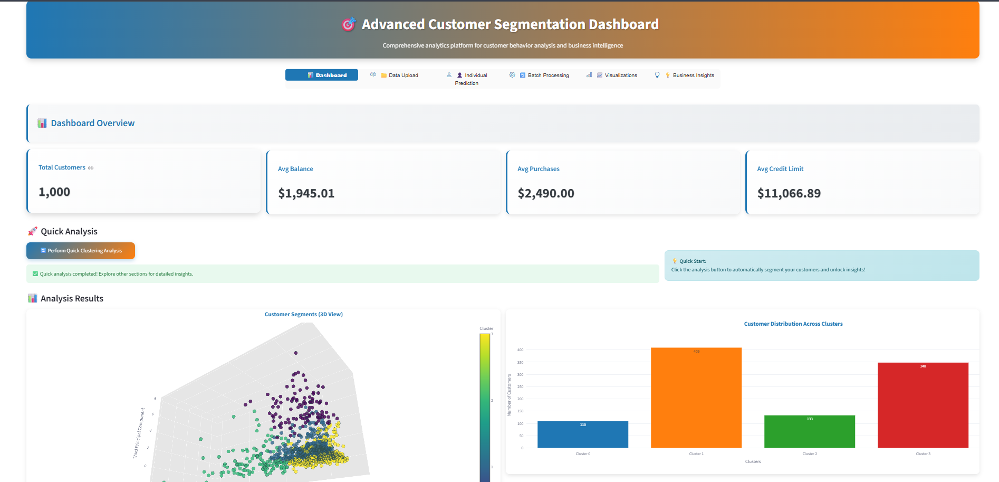
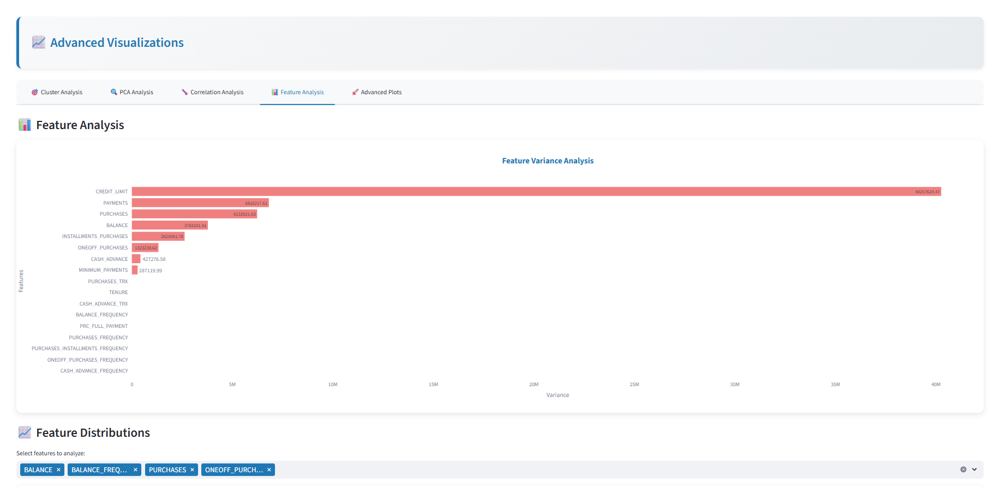
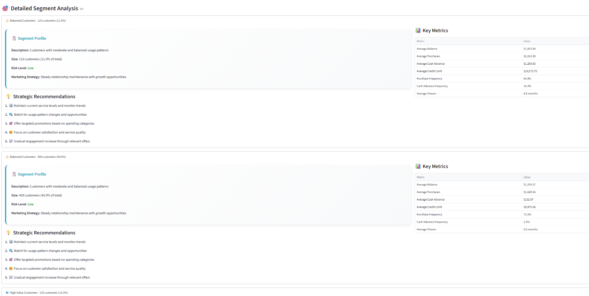

# Customer Segmentation Project

This project implements a customer segmentation pipeline using machine learning techniques, specifically KMeans and DBSCAN clustering. It includes data ingestion, validation, transformation, exploratory data analysis (EDA), model training, evaluation, a Flask web interface for batch predictions and a Streamlit application for visualization , Prediction and Business Insights.

## Project Structure

The project follows a modular structure:

```
customer_segments/
├── customer_segmentation_app.py # Main streamlit application for visualization , Prediction and Business Insights 
├── app.py                      # Flask application for UI and batch prediction
├── main.py                     # Main script to run the training pipeline
├── requirements.txt            # Python dependencies
├── README.md                   # This file
│
├── customer_data/              # Directory for input CSV data (e.g., data_credit_card_customer_seg.csv)
├── final_model/                # Stores the trained model (model.pkl) and preprocessor (preprocessor.pkl)
├── prediction_output/          # Stores clustered results from batch prediction (clustered_results.csv)
├── templates/                  # HTML templates for Flask UI
│   └── index.html
├── uploads/                    # Temporary storage for uploaded CSV files via UI
│
└── custsegments/               # Core library for the segmentation pipeline
    ├── __init__.py
    ├── components/             # Individual pipeline components
    │   ├── __init__.py
    │   ├── data_ingestion.py
    │   ├── data_validation.py
    │   ├── data_transformation.py
    │   ├── eda_analysis.py
    │   ├── model_trainer.py
    │   └── clustering_evaluation.py
    ├── pipeline/               # Pipeline orchestration
    │   ├── __init__.py
    │   ├── training_pipeline.py
    │   └── batch_prediction.py
    ├── utils/                  # Utility functions
    │   ├── __init__.py
    │   ├── main_utils/
    │   │   ├── __init__.py
    │   │   └── utils.py
    │   └── ml_utils/
    │       ├── __init__.py
    │       └── clustering_metrics.py
    ├── entity/                 # Data classes for configurations and artifacts
    │   ├── __init__.py
    │   ├── config_entity.py
    │   └── artifact_entity.py
    ├── logging/                # Custom logging setup
    │   ├── __init__.py
    │   └── logger.py
    ├── exception/              # Custom exception handling
    │   ├── __init__.py
    │   └── exception.py
    └── constant/               # Project constants
        ├── __init__.py
        └── training_pipeline/
            └── __init__.py
```

## Setup and Installation

1.  **Clone the repository (if applicable).**
2.  **Create a virtual environment (recommended):**
    ```bash
    python -m venv venv
    source venv/bin/activate  # On Windows: venv\Scripts\activate
    ```
3.  **Install dependencies:**
    ```bash
    pip install -r requirements.txt
    ```
4.  **Place the dataset:**
    Ensure your customer dataset (e.g., `data_credit_card_customer_seg.csv`) is placed in the `customer_segments/customer_data/` directory. If it's not there, the `main.py` script or the `/run_training` Flask endpoint will attempt to copy it from `customer_segments/1) Dataset/` (the original repo location) or create dummy data if not found.

## Running the Project

### 1. Training Pipeline

To train the models and generate all artifacts:

```bash
python customer_segments/main.py
```
This will:
- Ingest data from `customer_data/`.
- Validate the data.
- Transform and preprocess the data.
- Perform EDA and save plots/reports to `customer_segments/artifacts/customer_segments_pipeline/<timestamp>/eda_analysis/`.
- Train KMeans and DBSCAN models.
- Save the primary model (KMeans) as `model.pkl` and the preprocessor as `preprocessor.pkl` in `customer_segments/final_model/`.
- Evaluate clustering models and save metrics and an insights report to `customer_segments/artifacts/customer_segments_pipeline/<timestamp>/clustering_evaluation/`.

Artifacts for each pipeline run are stored in a timestamped directory under `customer_segments/artifacts/customer_segments_pipeline/`. The `final_model/` directory is updated with the latest trained model and preprocessor from the most recent successful training run orchestrated by the main training script or a similar mechanism (if the pipeline is designed to update it directly).

### 2. Flask Web Application (for Batch Prediction)

To run the Flask web application:

```bash
python customer_segments/app.py
```
The application will be available at `http://0.0.0.0:8080` (or `http://127.0.0.1:8080`).

**Features:**
-   **Upload CSV:** Upload a new CSV file containing customer data (matching the expected schema, excluding CUST_ID for features if a preprocessor is used that way).
-   **Predict:** The application will use the trained model and preprocessor from `final_model/` to assign cluster labels to the uploaded data.
-   **Display Results:** Shows a preview of the clustered data, summary insights (cluster distribution, total customers, etc.), and a basic visualization of cluster counts.
-   **Download Results:** Provides a link to download the full CSV with added cluster labels (`clustered_results.csv` saved in `customer_segments/prediction_output/`).
-   **Run Training Pipeline:** A button is available on the UI to trigger the training pipeline (for demo purposes).

**Note on Model and Preprocessor for Flask App:**
The Flask app (`app.py`) expects `model.pkl` and `preprocessor.pkl` to be present in the `customer_segments/final_model/` directory. Ensure the training pipeline (`main.py`) has been run at least once to generate these files, or place pre-trained compatible files there.

## 3. Streamlit Application (for Visualization, Prediction, and Business Insights)[fastest/Recommended]
To run the Streamlit application for visualization, prediction, and business insights:

```bash
streamlit run customer_segments/customer_segmentation_app.py
```
how to place image here copilot : place all the images with one line description from images folder

 description: This is the main interface of the streamlit application. 
 description: This is the individual prediction interface of the streamlit application.
 description: This is the batch prediction interface of the streamlit application. with k means and dbscan parameter tuning . And elbow method ,silhouette score analysis visualizations.
 description : Advanced visualizations for pca , features ,correlation , cluster analysis
 description: This is the business insights interface of the streamlit application. 


## Core Technologies

-   Python 3.x
-   Pandas: Data manipulation and analysis.
-   NumPy: Numerical operations.
-   Scikit-learn: Machine learning (KMeans, DBSCAN, preprocessing, metrics).
-   Flask: Web framework for the UI and API.
-   Matplotlib & Seaborn: Data visualization for EDA.
-   PyYAML: For potential future configuration management.
-   Dill: For object serialization (alternative to pickle).

## Custom Implementations

-   **Logging:** Custom logger (`custsegments/logging/logger.py`) to record messages with timestamp, filename, line number, and severity. Logs are saved to a `logs/` directory in `customer_segments/`.
-   **Exception Handling:** Custom exception classes (`custsegments/exception/exception.py`) for more informative error messages.
-   **Entity System:** Dataclasses (`custsegments/entity/`) for structured configuration (`config_entity.py`) and artifact (`artifact_entity.py`) management.
-   **Modular Pipeline:** Components for each stage of the ML lifecycle, orchestrated by pipeline scripts.


